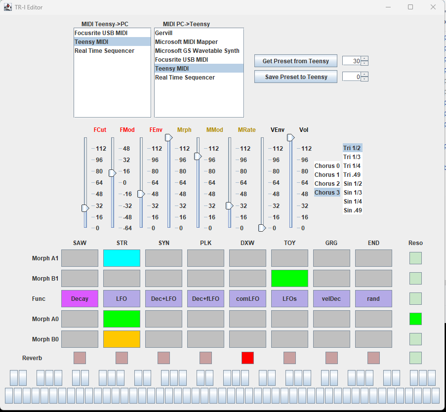

# TR-I Morphing Synthesizer
Teensy4.1 based Transdimensional Morphing Synthesizer number one.

**You only need a Teensy4.1 and a I2S audio DAC to try it.**

**Add a SH1106 OLED and a USB Host adapter and you can use an Akai APC25Key Mark II for direct control**


https://youtu.be/8HZv_8R1IUs

https://youtu.be/qpshYl_NxRQ

## Features

- Morphing based synthesis
- 8 voice polyphony
- 32 "morphemes"
    - a starting point consists of a pair of morphemes
    - the ending point consists of another pair of morphemes
- core synth engine based on dual hard synched phase modulation (2x3 operators) with multiple feedbacks, detunes and chaotic generators (the "morphemes" take care of that) and a two pole resonant low pass filter.
- 96kHz sample rate (for a brighter sound and controlled aliasing)
- Optional balanced output mode (using two I2S dacs) for better quality
- Reverberation
- Chorus
- CC control of synthesis parameters
- Presets through Midi Program Changes (20 presets available on version alpha003).
- Possible direct control of the synthesis engine with an [Akai APC key 25 mk2](https://www.akaipro.com/apc-key-25-mkii.html)
- Display on a 1"33 SH1106 or 2"42 SSD1309 OLED (scope and parameters)
- MIDI sources:
    - USB device port (computer)
    - USB Host (from a Akai APC key 25 mk2)
    - MIDI Din (H11L1 optocoupler on RX1)

[**---> Little video tutorials here <---**](https://www.youtube.com/watch?v=_vbfbmH16PU&list=PLi62YXvdJFO0XG5JfScvJ0Ga7yxIYp9uY)

## Transdimensional ?
_Transdimensional_ is a fancy name for a way to simplify the use of very complicated synthesis algorithm.
It is a kind of morphing that takes care of navigating through the synthesis parameter hyperspace.
_Thierry-Rochebois-I_ navigates in a 54 dimension hyperspace.


## TR-I (Thierry-Rochebois-I)

I had many funny names in mind but most of them would have been a cause of conflict
with existing products.
Feels weird to name a synth after myself... but that's the easy way to avoid
troubles with trademarks.

----------------------------------------------------------------------------
## Versions

The project is still in its alpha stages (that means that some implementations can
evolve).
[Here is the info about the occuring alpha versions](./Versions.md)


----------------------------------------------------------------------------
## Configurations

I designed this project so that you can test it with a very small configuration
and add what you want.

### Base
**You only need a Teensy4.1 and a I2S audio DAC to try it...**
It will be responsive to note Ons, Program Changes and control Changes from your PC/Daw.

I coded a little preset editor so that you can edit and flash your own presets in EEPROM.



and if you like it you can add some goodies if you want to go further.
### Options
- OLED SH1106 (for oscilloscope and parameter display)
- Midi Din (on RX1)
- Akai APC25 Mk2 on USBHost for direct sound editing.
- Secondary I2S audio DAC for higher quality balanced outputs.


### Teensy4.1 to UDA1334A Breakout
[AdaFruit Id3678](https://www.adafruit.com/product/3678)  or copy

```             
             
                        GND              Vin        -----------> VIN
                          0              GND        -----------> GND
                          1              3V3
                          2              23
                          3              22
                          4              21  BCLK1  -----------> BCLK
                          5              20  LRCLK1 -> 100 Ohm-> WSEL
                          6              19
      DIN <------- OUT1A  7              18            
                          8              17
                          9              16
                         10              15
                         11              14
                         12              13
                        3V3              GND
                         24              41
                         25              40
                         26              39
                         27              38
                         28              37
                         29              36
                         30              35
                         31              34
                         32              33
```

This DAC does not need a master clock, it has its own PLL to generate it based on the LRCLK1 (WSEL).
So this input is very sensitive to transients. To avoid issues, simply add a 100ohm resistor on the input of the breakout
(it will prevent inductive/capacitive oscillations).

### Teensy4.1 to PCM5102A Breakout
They are quite cheap and high quality dacs.
Most breakouts already have resistors on their inputs to avoid inductive oscillations.
The optional SCK must be grounded by adding a solder blob.

```             
             
                        GND              Vin        --> VIN
                          0              GND        --> GND
                          1              3V3
                          2              23
                          3              22
                          4              21  BCLK1  --> BCK
                          5              20  LRCLK1 --> LCK
                          6              19
      DIN <------- OUT1A  7              18            
                          8              17
                          9              16
                         10              15
                         11              14
                         12              13
                        3V3              GND
                         24              41
                         25              40
                         26              39
                         27              38
                         28              37
                         29              36
                         30              35
                         31              34
                         32              33
```


### Installing a secondary I2S DAC for balanced outputs

Connect the secondary I2S like the primary but replace OU1A (7) by OUT1B (32) as an input to the DAC.

### MIDI Din input on RX1
Using a H11L1 optocoupler.
The H11L1 is a fast, reliable and easily available optocoupler.
So a 4k7 pull up resistor is good enough for Midi baud rates.
(Low values can even cause unwanted glitches on the 3V3 rail because of the H11L1 sharp transients).

```
MIDI DIN                               H11L1                         TEENSY

PIN 4  ----|220 Ohms|----+--------|1           6|------+------------+-- 3V3
                        ---       |             |      |            |
              1N4148    / \       |             |    ===== 100nF    |
                         |        |             |      |           | |
PIN 5  ------------------+--------|2           5|------+-- GND     | | 
                                  |             |              4k7 | |
                                  |             |                   |
                                  |             |                   |
                                  |3           4|-------------------+-- RX1
```


----------------------------------------------------------------------------
## Presets
| PC  | Preset            | PC    | Preset  | PC   | Preset           | PC   | Preset  |
|-----|-------------------|-------|---------|------|------------------|------|---------|
| `0` | bass              | `8`   | clav1   | `16` | Horror Pad       | `24` | 1988    |   
| `1` | china             | `9`   | clav2   | `17` | Horror Vox       | `25` | evening |
| `2` | chordéon (wheel)  | `10`  | FM Bass | `18` | Crazy Robot      | `26` | SF      |
| `3` | west (wheel)      | `11`  | space   | `19` | Dry Slap         | `27` | Basic   |
| `4` | sync (wheel)      | `12`  | harsh1  | `20` | Forbidden Planet | `28` | Basic   |
| `5` | sync harp(wheel)  | `13`  | haunted | `21` | Nice Noise       | `29` | Basic   |
| `6` | sync dream(wheel) | `14`  | Baroque | `22` | Broken           | `30` | Basic   |
| `7` | phaser(wheel)     | `15`  | Horror  | `23` | Solino           | `31` | Basic   |


## CC

### Patch CCs

|  CC  | Description        | CC Values | Notes                                                                                    |
|------|--------------------|-----------|------------------------------------------------------------------------------------------|
|   `7`| Volume             | 0..127    |                                                                                          |
|  `91`| Reverb             | 0..7      |                                                                                          |
|  `93`| Chorus Type        | 0..3      |                                                                                          |
|  `74`| Filter Cutoff      | 0..127    |                                                                                          |
|  `73`| Filter Mod         | 0..127    | scales to -64..63 semitones                                                              |
|  `72`| Filter Decay time  | 0..127    |                                                                                          |
|  `71`| Filter Resonance   | 0..5      |                                                                                          |
|  `16`| Volume enveloppe   | 0..127    | 0 Gate -> 40 longer release -> 64 smooth AR -> 127 Brass                                 |
|   `1`| ModWheel = MORPH   | 0..127    | The Morph parameter                                                                      |
|  `18`| Morph Mod Depth    | 0..127    | if 127 the modulation takes full control and the modwheel has no effect                  |
|  `19`| Morph Mod Rate     | 0..127    | The rate of mod modulation                                                               |
|  `77`| Morph Function     | 0..7      | The morph modulator type... LFOs or enveloppes... see table below                        |
|  `78`| A1 Morpheme 1      | 0..31     | all available since alpha001                                                             |
|  `79`| B1 Morpheme 1      | 0..32     | all available since alpha001                                                             |
|  `75`| A0 Morpheme 1      | 0..31     | all available since alpha001                                                             |
|  `76`| B0 Morpheme 1      | 0..32     | all available since alpha001                                                             |
|  `94`| Wave symetry ratio | 0..7      | 0..3 triangle based <br/>4..7 sine based<br/>T1/2 T1/3 T1/4 T.49<br/>S1/2 S1/3 S1/4 S.49 |

### Editor CCs

| CC    | Description                 | CC Values | Notes                                                                                             |
|-------|-----------------------------|-----------|---------------------------------------------------------------------------------------------------|
| `118` | Send current preset request | X         | Requests the current synth settings to be sendt as a series of CC from the Teensy to the computer |
| `119` | Save to presets             | 0..127    | Saves the current preset settings to the teensy EEPROM. The CC controls the location              |


## Morph Function
Without morph modulation, the morphing from [A0,B0] to [A1,B1] is controlled by the modwheel.
With Morph Mod Depth `CC18` part of the morphing will be controlled by the Morph Function Generator which provides 8 different functions selected by `CC77`

| Value | Description                | Note                                                                              |
|----|----------------------------|-----------------------------------------------------------------------------------|
| `0` | Decay                      | The most used mode                                                                |
| `1` | Note triggered LFO         | starts like the decay and then goes back in the other direction...                |
| `2` | Decay + Note triggered LFO | Useful to have the sound still "alive" after the decay                            |
| `3` | Decay + fast LFO           |                                                                                   |
| `4` | Common LFO                 | A common LFO is great for Phaser like modulation of the sound when playing chords |
| `5` | Combination of LFOs        | Vibrations... vibrations...                                                       |
| `6` | Velocity modulated Decay   | Expressive                                                                        |
| `7` | Random S&H                 | Let robots have a talk!                                                           |

## Morpheme list

Values used for CC `78`, `79`, `75` and `76`.

| Group                                                       | CC value | Description       | CC value | Description      | CC value | Description   | CC value | Description    |
|-------------------------------------------------------------|----------|-------------------|----------|------------------|----------|---------------|----------|----------------|
| Saw<br/>Basic waves<br/>If you are into virtual analog      | 0        | Base              | 1        | Base octave      | 2        | Saw           | 3        | Saw octave     |
| Str<br/>Basic with chorus                                   | 4        | Base with vibrato | 5        | Base with Chorus | 6        | Str chorus    | 7        | Fat Str chorus |
| Syn<br/>For sync sweeps                                     | 8        | Base 3oct up      | 9        | Saw up det       | 10       | Saw up detune | 11       | Saw up Chorus  |
| Plk<br/>for plucked FMish sounds                            | 12       | Pluck             | 13       | Plk vib Ch       | 14       | Plk vib Ch    | 15       | Plk vib Ch     |
| DXW<br/>FM and phase distorsion                             | 16       |                   | 17       |                  | 18       |               | 19       |                |
| Toy<br/>Noisy stuff<br/>Nice for Fx and Sci Fi stuff        | 20       |                   | 21       |                  | 22       |               | 23       |                |
| Grg<br/>Formantic...<br/>because everybody needs twangy sounds sometimes | 24       | Formant A         | 25       | Formant OO       | 26       | Ethnic 1      | 27       | Ethnic 2       |
| End<br/>Low level noisy<br/>useful for attacks or end of sounds | 28       | Noise Low         | 29       | Noise High       | 30       | Chaotic 1     | 31       | Chaotic 2      |

On the APC25 the pads column corresponds to the group and the color corresponds to the variant
(0:green 1:yellow 2:red 3:cyan)

## Using an APC Key25 MkII for direct sound design

An APC Key25 MarkII allows direct and live controls of synthesis parameters.


