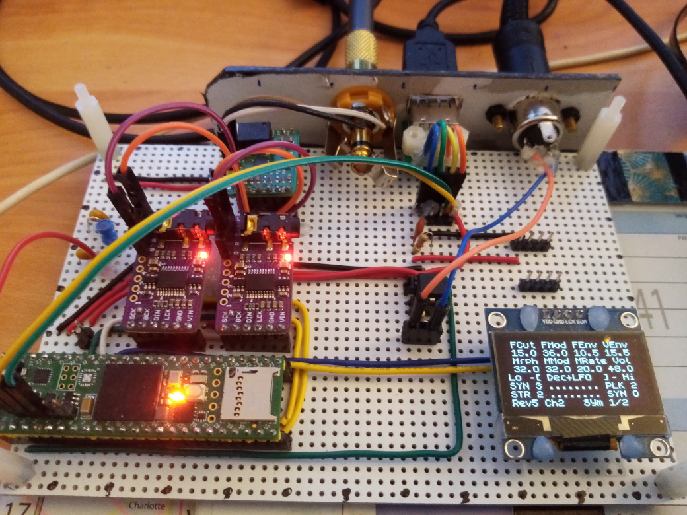
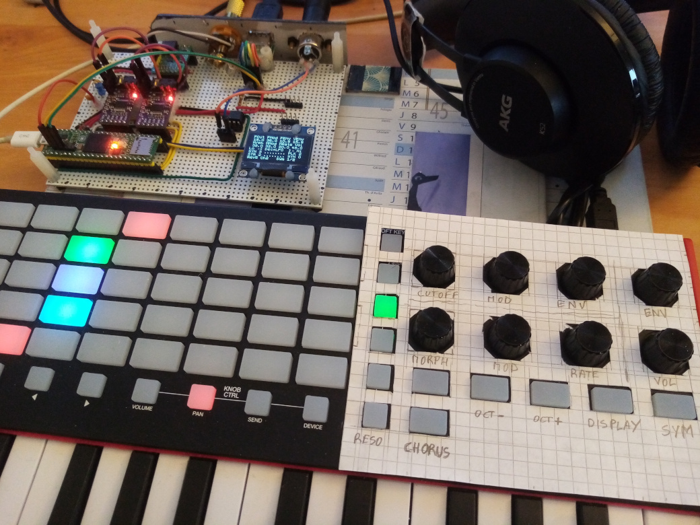
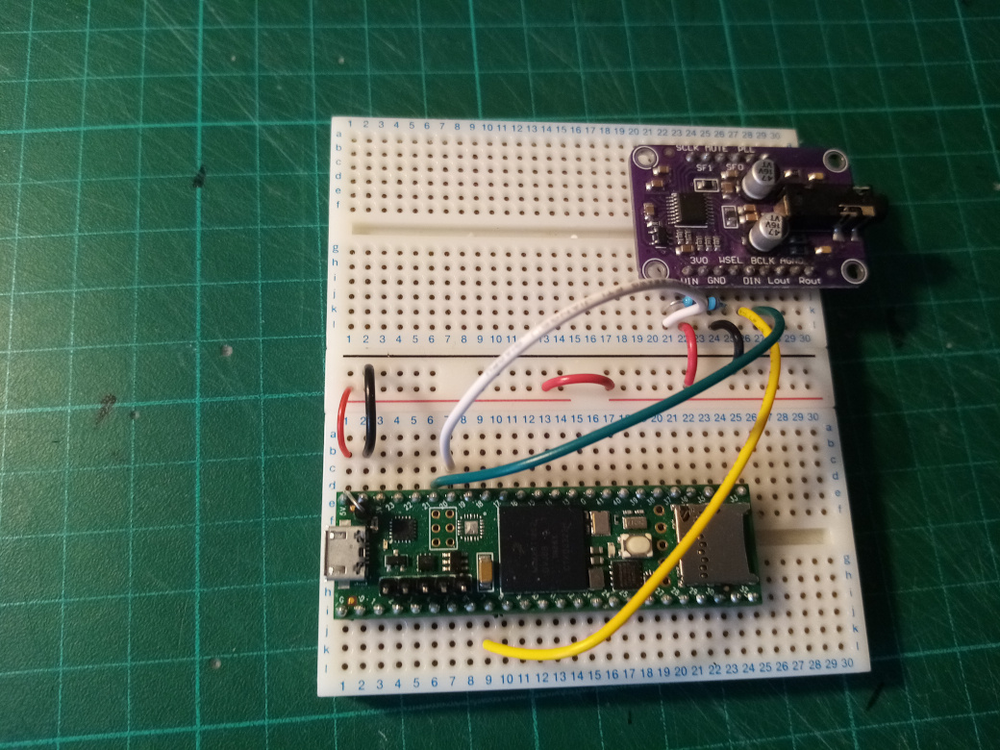
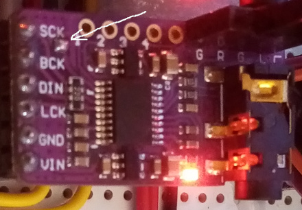
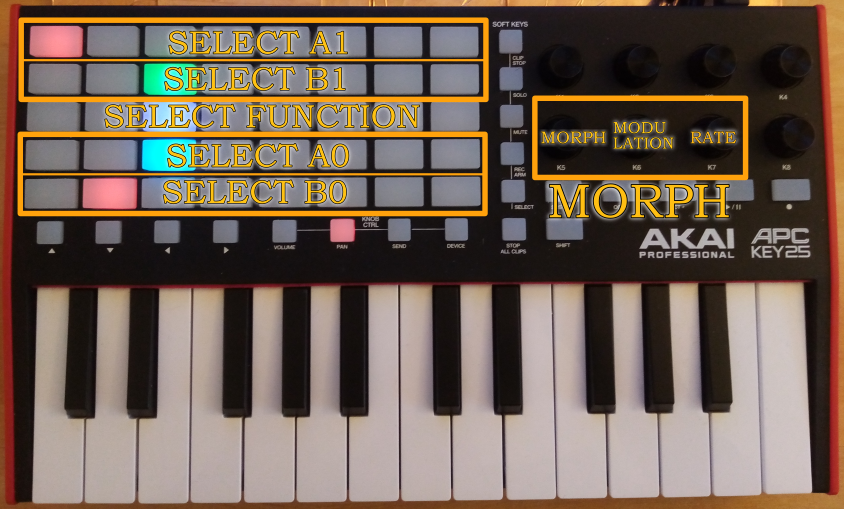
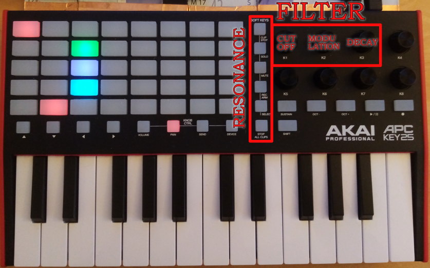
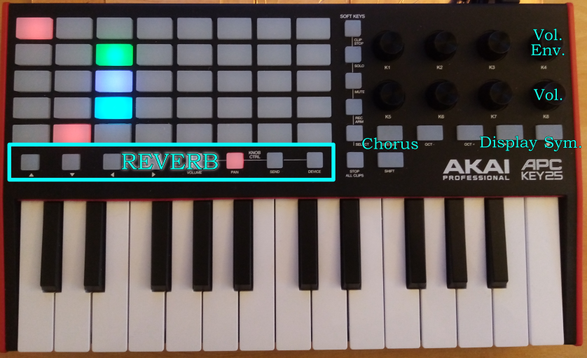

# Thierry-Rochebois-I
Teensy4.1 based Transdimensional Morphing Synthesizer number one.

**You only need a Teensy4.1 and a I2S audio DAC to try it.**

## Transdimensional ?
_Transdimensional_ is a fancy name for a way to simplify the use of very complicated synthesis algorithm.
It is a kind of morphing that takes care of navigating through the synthesis parameter hyperspace.
_Thierry-Rochebois-I_ navigates in a 54 dimension hyperspace.

## Features

- 8 voice polyphony
- 96kHz sample rate (for a brighter sound and controlled aliasing)
- Morphing based synthesis 
- 32 "morphemes"
  - a starting point consists of a pair of morphemes
  - the ending point consists of another pair of morphemes
- Reverberation
- Chorus
- CC control of synthesis parameters
- Presets through Midi Program Changes ( 15 presets already available on version alpha001).


## Thierry-Rochebois-I

Yes, it's my real name. It can seem weird to name a synth after myself... but that's an easy way to avoid
troubles with trademarks. I had many funny names in mind but most of them would have been a cause of conflict
with existing products.

----------------------------------------------------------------------------
## Versions
### Thierry-Rochebois-I-alpha001
Updates :
- 8 new presets
- all 32 "morphemes" are now implemented
- Triangle or Sine based engine (so that analogish and FMish sounds are possible)
- support for Pitch Bend (+- 2 semitones)
- if an APC25Key II is attached the presets can be accessed through "shift+pad"

A short demo of these fm oriented presets: https://youtu.be/qpshYl_NxRQ

### Thierry-Rochebois-I-alpha000
It is my first GitHub publication for almost 5 years (I was pretty active with the Axoloti then). I discovered the
Teensy4.1 a year ago.
With alpha000 you already have 7 presets available (through midi program changes). 
They are based on a recreation of classic waveforms and hardsync.

I will add more details about the hardware options and the various Midi controls this week end.

A short demo of these presets:  

----------------------------------------------------------------------------
## Configurations
### Base
**You only need a Teensy4.1 and a I2S audio DAC to try it...** 

and if you like it you can add some goodies if you want to go further.
### Options
- OLED SH1106 (for oscilloscope and parameter display) 
- Midi Din (on RX1)
- Akai APC25 Mk2 on USBHost for direct sound editing.
- Secondary I2S audio DAC for symetrical outputs.



             
### Teensy4.1 to UDA1334A Breakout 
[AdaFruit Id3678](https://www.adafruit.com/product/3678)  or copy

```             
             
                        GND              Vin        -----------> VIN
                          0              GND        -----------> GND
                          1              3V3
                          2              23
                          3              22
                          4              21  BCLK1  -----------> BCLK
                          5              20  LRCLK1 -> 100 Ohm-> WSEL
                          6              19
      DIN <------- OUT1A  7              18            
                          8              17
                          9              16
                         10              15
                         11              14
                         12              13
                        3V3              GND
                         24              41
                         25              40
                         26              39
                         27              38
                         28              37
                         29              36
                         30              35
                         31              34
                         32              33
```

This DAC does not need a master clock, it has its own PLL to generate it based on the LRCLK1 (WSEL).
So this input is very sensitive to transients. To avoid issues, simply add a 100ohm resistor on the input of the breakout 
(it will prevent inductive/capacitive oscillations).

### Teensy4.1 to PCM5102A Breakout 
They are quite cheap and high quality dacs.
Most breakouts already have resistors on their inputs to avoid inductive oscillations.
The optional SCK must be grounded by adding a solder blob.

```             
             
                        GND              Vin        --> VIN
                          0              GND        --> GND
                          1              3V3
                          2              23
                          3              22
                          4              21  BCLK1  --> BCK
                          5              20  LRCLK1 --> LCK
                          6              19
      DIN <------- OUT1A  7              18            
                          8              17
                          9              16
                         10              15
                         11              14
                         12              13
                        3V3              GND
                         24              41
                         25              40
                         26              39
                         27              38
                         28              37
                         29              36
                         30              35
                         31              34
                         32              33
```

----------------------------------------------------------------------------

## Presets (alpha001)
| PC | Preset            | PC | Preset  |
|----|-------------------|----|---------|
| `0` | bass              | `8` | clav1   |
| `1` | china             | `9` | clav2   |
| `2` | chordéon (wheel)  | `10` | FM Bass |
| `3` | west (wheel)      | `11` | space   |
| `4` | sync (wheel)      | `12` | harsh1  |
| `5` | sync harp(wheel)  | `13` | haunted |
| `6` | sync dream(wheel) | `14` | Baroque |
| `7` | phaser(wheel)     | `15` |         |


## CC

|  CC  | Description        | CC Values | Notes                                                                   |
|------|--------------------|-----------|-------------------------------------------------------------------------|
|   `7`| Volume             | 0..127    |                                                                         |
|  `91`| Reverb             | 0..7      |                                                                         |
|  `93`| Chorus Type        | 0..3      |                                                                         |
|  `74`| Filter Cutoff      | 0..127    |                                                                         |
|  `73`| Filter Mod         | 0..127    | scales to -64..63 semitones                                             |
|  `72`| Filter Decay time  | 0..127    |                                                                         |
|  `71`| Filter Resonance   | 0..5      |                                                                         |
|  `16`| Volume enveloppe   | 0..127    | 0 Gate -> 40 longer release -> 64 smooth AR -> Brass                    |
|   `1`| ModWheel = MORPH   | 0..127    | The Morph parameter                                                     |
|  `18`| Morph Mod Depth    | 0..127    | if 127 the modulation takes full control and the modwheel has no effect |
|  `19`| Morph Mod Rate     | 0..127    | The rate of mod modulation                                              |
|  `77`| Morph Function     | 0..7      | The morph modulator type... LFOs or enveloppes... see table below       |
|  `78`| A1 Morpheme 1      | 0..31     | all available on alpha001                                               |
|  `79`| B1 Morpheme 1      | 0..32     | all available on alpha001                                               |
|  `75`| A0 Morpheme 1      | 0..31     | all available on alpha001                                               |
|  `76`| B0 Morpheme 1      | 0..32     | all available on alpha001                                               |
|  `94`| Wave symetry ratio | 0..7      | 0..3 triangle based 4..7 sine based                                     |

## Morph Function
Without morph modulation, the morphing from [A0,B0] to [A1,B1] is controlled by the modwheel.
With Morph Mod Depth `CC18` part of the morphing will be controlled by the Morph Function Generator which provides 8 different functions selected by `CC77`

| Value | Description                | Note                                                                              |
|----|----------------------------|-----------------------------------------------------------------------------------|
| `0` | Decay                      | The most used mode                                                                |
| `1` | Note triggered LFO         | starts like the decay and then goes back in the other direction...                |
| `2` | Decay + Note triggered LFO | Useful to have the sound still "alive" after the decay                            |
| `3` | Decay + fast LFO           |                                                                                   |
| `4` | Common LFO                 | A common LFO is great for Phaser like modulation of the sound when playing chords |
| `5` | Combination of LFOs        | Vibrations... vibrations...                                                       |
| `6` | Velocity modulated Decay   | Expressive                                                                        |
| `7` | Random S&H                 | Let robots have a talk!                                                           |

## Morpheme list
| Group                         | N | Description | N | Description | N | Description   | N | Description    |
|-------------------------------|---|-------------|---|-------------|---|---------------|---|----------------|
| Saw: Basic waves              | 0 | Tri simple  | 1 | Tri octave  | 2 | Saw simple    | 3 | Saw octave     |
| Str: Basic with chorus        | 0 | Tri vibrato | 1 | Tri Chorus  | 2 | Str chorus    | 3 | Fat Str chorus |
| Sync: For sync sweeps         | 0 | Tri 3oct up | 1 | Saw up det  | 2 | Saw up detune | 3 | Saw up Chorus  |
| Plk: for plucked FMish sounds | 0 | Pluck       | 1 | Plk vib Ch  | 2 | Plk vib Ch    | 3 | Plk vib Ch     |
| DXW: FM and phase dist        | 0 |             | 1 |             | 2 |               | 3 |                |
| Toy: Noisy stuff              | 0 |             | 1 |             | 2 |               | 3 |                |
| Grg: Formantic                | 0 | Formant A   | 1 | Formant OO  | 2 | Ethnic 1      | 3 | Ethnic 2       |
| End: Low level noisy          | 0 | Noise Low   | 1 | Noise High  | 2 | Chaotic 1     | 3 | Chaotic 2      |

On the APC25 the pads column corresponds to the group and the color corresponds to the variant 
(0:green 1:yellow 2:red 3:cyan)

## Using an APC Key25 MkII for direct sound design

An APC Key25 MarkII allows direct and live controls of synthesis parameters.







