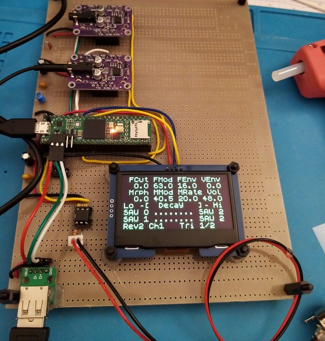

----------------------------------------------------------------------------
## Versions

### Thierry-Rochebois-I-alpha010

Transmits Midi coming from the midi Din to the PC

### Thierry-Rochebois-I-alpha009

Sends sound editing to the PC via usb:
CCs and program changes
shift+Chorus -> sends all parameters as CCs

### Thierry-Rochebois-I-alpha008

Code refactoring

### Thierry-Rochebois-I-alpha007

A few more presets.
Better display stability of the oscilloscope

### Thierry-Rochebois-I-alpha006

A few more presets.
Anti zip noise filter on wheel modulation.

### Thierry-Rochebois-I-alpha005

Added support for "big" 2"42 I2C SSD1309 OLEDS

This mode is activated by grounding GPIO 3.

### Thierry-Rochebois-I-alpha004

Added support for balanced outputs mode using two I2S DACs.
In this mode, each DAC acts like a mono balanced output 
(one dac for the left, one dac for the right).

This mode is activated by grounding GPIO 2.

Default mode is the usual stereo output

### Thierry-Rochebois-I-alpha003

Bug fixes and 6 more presets

### Thierry-Rochebois-I-alpha002

Added support for the [Teensy Audio Adaptor Board](https://www.pjrc.com/store/teensy3_audio.html).
-> Added I2C controls to enable it and set volume gain to 1. (which is not the case with previous
versions)

### Thierry-Rochebois-I-alpha001
Updates :
- 8 new presets
- all 32 "morphemes" are now implemented
- Triangle or Sine based engine (so that analogish and FMish sounds are possible)
- support for Pitch Bend (+- 2 semitones)
- if an APC25Key II is attached the presets can be accessed through "shift+pad"

A short demo of these fm oriented presets: https://youtu.be/qpshYl_NxRQ

### Thierry-Rochebois-I-alpha000
It is my first GitHub publication for almost 5 years (I was pretty active with the Axoloti then). I discovered the
Teensy4.1 a year ago.
With alpha000 you already have 7 presets available (through midi program changes). 
They are based on a recreation of classic waveforms and hardsync.

I will add more details about the hardware options and the various Midi controls this week end.

A short demo of these presets:  
